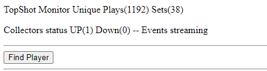
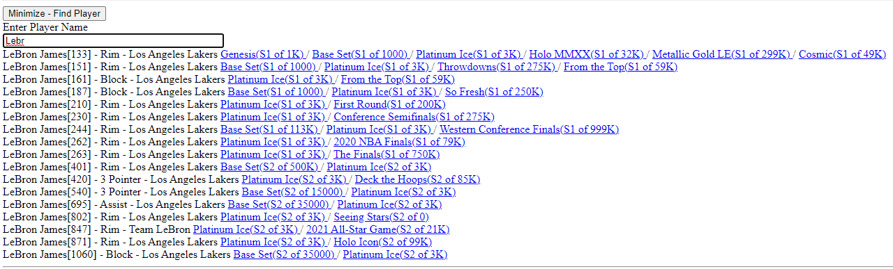
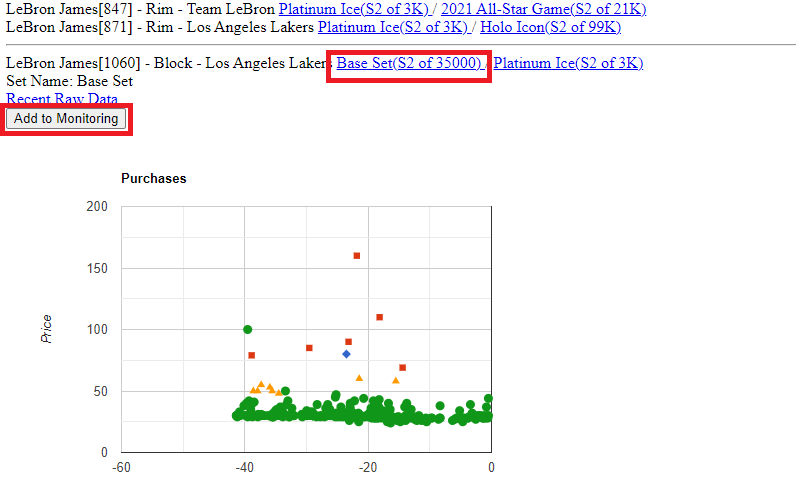
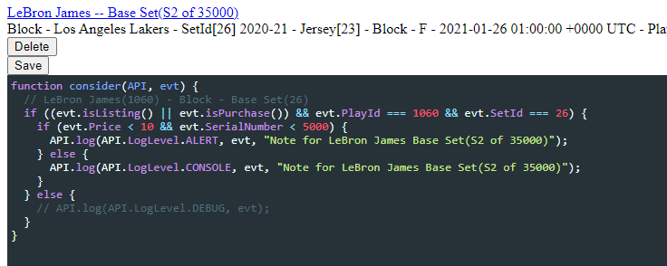
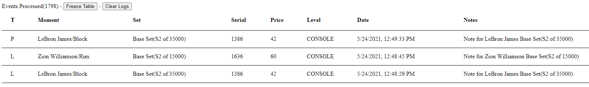

# TopshotAlert UI

This project is the frontend allowing users to monitor moments from the NBA TopShots.  It was written in Angular and depends on ***purchase-events*** to populate the purchase/listing events and ***topshot-functions*** backend to serve the live data.

Do NOT attempt to run this project until you have a working ***topshot-functions*** deployed.

## Deploying to Google Cloud
- Make sure you configure AppConfigService.getPlayDataEndpoint() to point to your ***topshot-functions*** backend.

```
  private getPlayDataEndpoint(): string {
    TODO POINT TO YOUR BACKEND
    return "https://************.cloudfunctions.net/GetPlayDataHTTP"
  }

```

- ng build --prod
  - This builds the Angular application and places it in the ***dist/topshot-alert*** directory.
- cp build/app.yaml to dist/ 
  - This is the Google Cloud App discriptor.  It runs a python runtime to serve the angular files.
- cd dist
- gcloud app deploy
  - This uploads and deploys your app to the cloud.  The public URL will be displayed in the console.

 ## Local Testing

 You can serve the application locally but you need a working backend API running.  It wouldn't be too hard to serve ***topshot-functions*** locally using a local database.

 # How It Works

The first screen will show you if there are active collectors populating the database with recent purchase/listing events.  If you do not see at least one active collector up, it means no ***purchase-events*** collectors are running.



The next step is to monitor one or more players you are interesting in viewing puchase/listing events.  You can search players by typing their names.



Select the exact play and set.  In this example, I want to get monitor the LeBron James block in the Base Set season 2.  


 
It is possible to customize the conditions which trigger a log event by editing and saving the javascript which runs for every purchase/listing event.  For example, if you are only interested in certain prices or serial numbers.




Once the conditions match, the events will be displayed to the log.




## Notes

- If you are monitoring an unpopular moment (one not actively traded) it may take a while to see an event.  I suggest first picking a popular player in an active set to ensure it is working.
- It is hard to snag a low priced moment
  - Incorrectly priced moments tend to be hard to purchase.  Everyone, including bots are continuously looking for moments which can be quickly flipped.  Also, the information coming to the UI is slightly delayed so it may be hard to acualy log into the marketplace before some other entity buys the moment.
